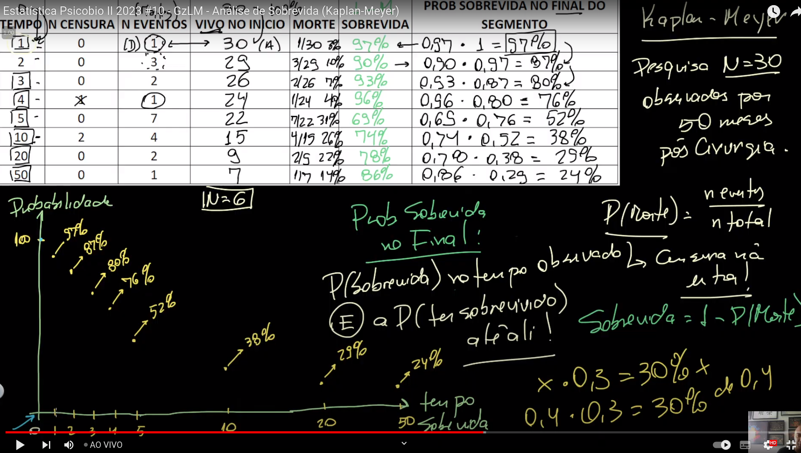

# aula um python

## assuntos
laços de repetição
if
operadores condicionais

```python
#exemplo 1
# primeiro cria uma lista com as entradas
list_tempo = []

list_tempo.append(int(input("coloque o tempo: ")))
list_tempo.append(int(input("coloque o tempo: ")))
# incrementa o contador


# mostrar a lista de inputs
print(list_tempo)

#for para passar pela lista convertendo

for tempo in list_tempo:
    segundos_converse = (tempo * 60)

    saida = f"o valor convertido é:{segundos_converse}"
    print(saida)

```

```python
#exemplo 2

# primeiro cria uma lista com as entradas
list_tempo = []

#n inputs usando o loop while
condador = 0

while(condador < 2):

    list_tempo.append(int(input("coloque o tempo: ")))
    # incrementa o contador
    condador += 1

# mostrar a lista de inputs
print(list_tempo)

#for para passar pela lista convertendo

for tempo in list_tempo:
    segundos_converse = (tempo * 60)

    saida = f"o valor convertido é:{segundos_converse}"
    print(saida)
```

vamos começar a pensar em como começar a modelar esse problema


fonte
[fonte video Altay](https://www.youtube.com/watch?v=J7V-pBniU_8&list=PLZjaOxYREinv_M_2nc-BIwptMbfIFipQj&index=10)
