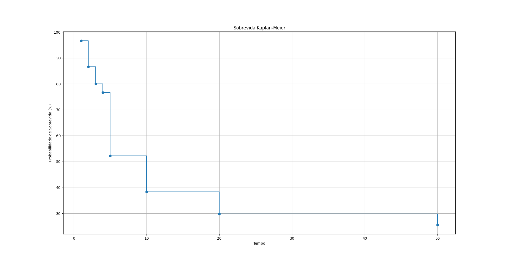

# Gráfico de Sobrevida Kaplan-Meier
Este repositório contém scripts para visualizar o Gráfico de Sobrevida Kaplan-Meier. São fornecidos dois métodos distintos para visualização:

- 1 **Matplotlib** - Uma implementação Python simples usando a biblioteca Matplotlib para traçar o gráfico.

- 2 **Dash** - Uma aplicação interativa usando Dash para visualizar os dados.


## Dados
Os dados representam o número de pacientes vivos no início, o tempo decorrido, número de eventos e censuras em determinados períodos.

## Como Executar
### Matplotlib
- 1 Certifique-se de ter o Matplotlib instalado. Caso não tenha, você pode instalá-lo com:
bash

```bash
pip install matplotlib
```

- 1 Execute o script sobrevida_matplotlib.py:
```bash
python sobrevida_matplotlib.py
```

Isso irá gerar e exibir o gráfico de sobrevida.

## Dash
Certifique-se de ter o Dash e suas dependências instaladas. Caso não tenha, 

```bash
pip install dash plotly
```

Execute o script sobrevida_dash.py:
```bash
python sobrevida_dash.py
```
.png>)

Isso iniciará um servidor local e você pode visualizar o gráfico em um navegador web acessando http://127.0.0.1:8050/.

